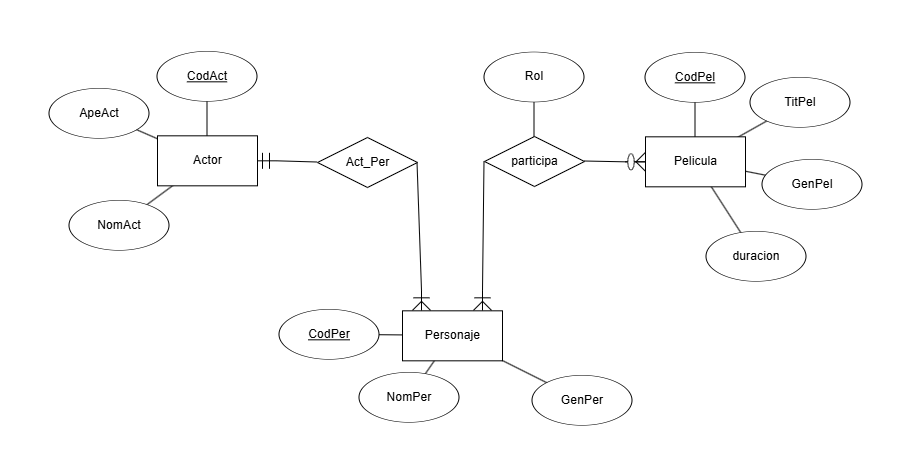
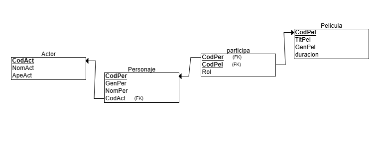

# Proyecto Interfaz de Cine

Este proyecto es una aplicación para ver información sobre un cine utilizando Java y una base de datos. La base de datos esta estructurada en tres tablas: **Actor**, **Personaje** y **Pelicula**. La aplicación permite crear, actualizar, borrar y visualizar el registro de actores, personajes y peliculas

## Diagrama Entidad-Relacion de la BBDD

- Restricciones y errores que controla la base da datos

## Diagrama Referencial de la BBDD

## Operaciones del Programa
El programa de Java habilita la ejecución de múltiples operaciones en tablas de bases de datos.

- **Crear**: Permite insertar nuevos registros en cualquiera de las tres tablas

- **Modificar**: Permite la modificación de los datos existentes en cualquier fila dentro de las tablas

- **Eliminar**: Autoriza la eliminación de registros particulares de las tablas según sea necesario.

- **Listar Todo**: Permite ver todas las filas en las tablas

- **Buscar por ID**: Esta función permite buscar entradas particulares por su ID de identificador única dentro de cada tabla
  
## Resumen
El programa permite la gestión de una base de datos sobre un cine de manera eficiente, pudiendo realizar varias acciones para manipular los datos
